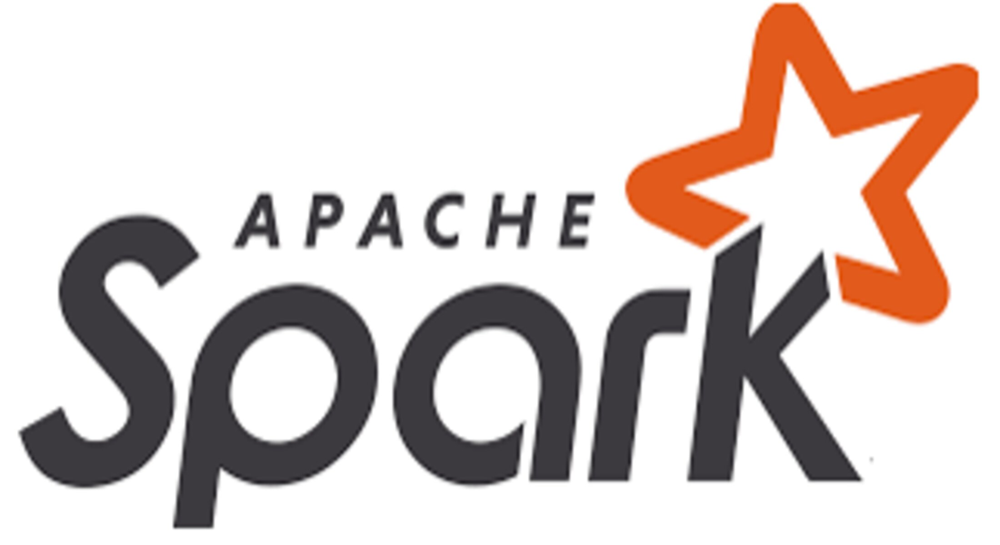

# CourseraIBM Advanced Deep Learning with Tensorflow course, data engineering and signal processing with Apache Spark, SystemML and PySpark

The course is structured to practical labs of data science and deep learning with a final assignment of a rolling bearing fault detector that works on the accelaration of rate-error on training.

